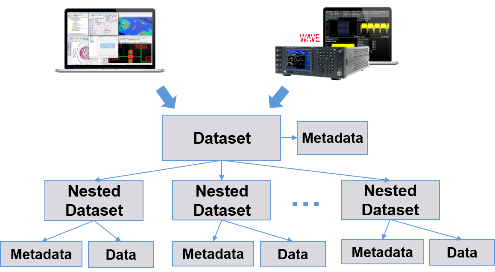
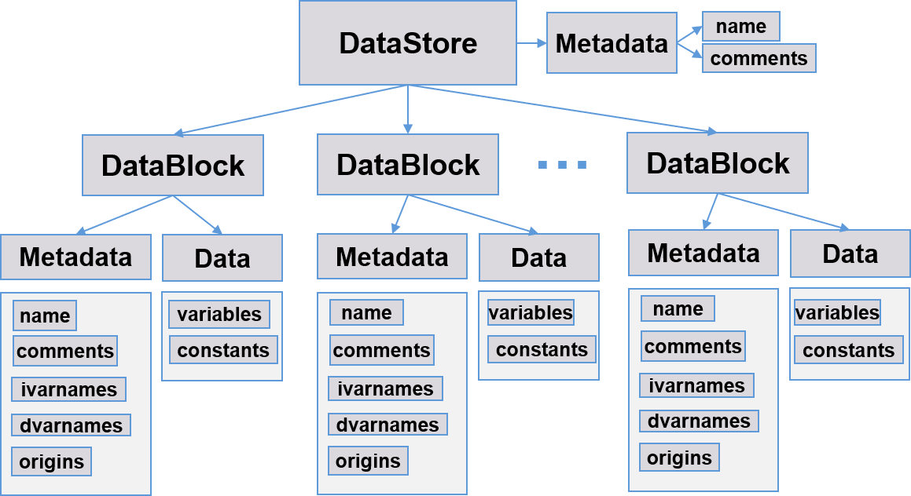
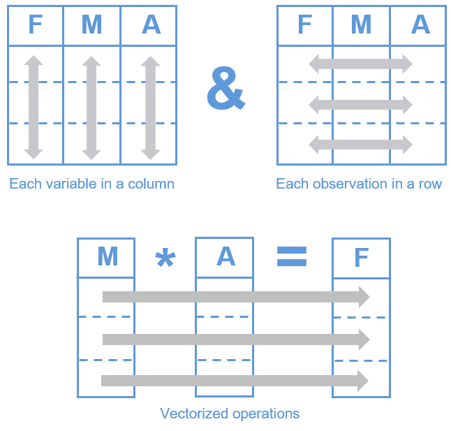

# Data Structures

**Last modified:** 10/04/2021  
**Reading time:** 8 min

## A Generalized Dataset Structure

No matter the source (measurement or simulation), datasets generally can be made to fit into the structure shown in Figure 1. Some datasets contain nested datasets, which are independent from one another. Therefore, a general dataset structure must accommodate nested datasets.

## DataStores and DataBlocks

`pwdatatools` provides two Python classes that represent the *Dataset* and *Nested Dataset* in Figure 1. The class that represents the top-level dataset is called `DataStore`, and the class that represents a nested, sub-dataset is called `DataBlock`. Instances of these classes can be created by importing a datafile, or by creating the data from scratch in Python. A DataStore may contain zero or more DataBlocks; however, they usually contain at least one DataBlock, or else it is of limited use. A DataStore can also optionally store metadata. Each DataBlock stores the actual data, as well as its own metadata. Figure 2 illustrates the relationships between DataStores, DataBlocks, data, and metadata.

The data in a DataBlock is separated into variables and constants. Each DataBlock is completely independent from any other. So, it is possible to have variables with the same name in separate DataBlocks, within the same DataStore, without conflicts. This is because each DataBlock maintains its own namespace for variables and constants.

The metadata in each DataBlock is stored in properties that the user can always access and can sometimes change. For example, the `origins` property includes information about where the data came from (was it read from an ADS dataset, or from ICCAP data, or from an MDIF file?… etc.). The `ivarnames` and `dvarnames` properties store information about which variables are the independents (called *ivars*) and which are the dependents (called *dvars*).

As mentioned previously, the data in a DataBlock is separated into variables and constants. Constants are stored in a Python dictionary. Variables are stored in a *pandas DataFrame*. Why use pandas DataFrames? See the next section for details.

## DataFrames

The `DataFrame` is one of two primary data structures provided in the [pandas](https://pandas.pydata.org/) library (the other is the `Series`). A DataFrame is a two-dimensional tabular data structure, similar to a SQL table or an Excel spreadsheet.

**Key Features:**

- support for heterogeneously-typed columns; therefore, variables of different types (e.g. real, complex, string, or integer) can be placed in each column
- easy handling of missing data points
- many ways of selecting data, including fancy indexing, slicing, and grouping functions
- various merge operations for combining datasets and variables
- built-in plotting functions; plus, many third-party plotting tools work directly on DataFrames

“Tidy Data” is a term that the pandas developers use to describe the “correct way” to organize data in DataFrames. If you follow the tidy data format as shown in Figure 3, there are several benefits, including fast vectorized operations and preservation of observations during manipulations. No other format will work better when using pandas DataFrames.

If you read a datafile using a `pwdatatools` function or class method (see [Read a File](https://docs.keysight.com/pwdt0x2x1/how-to/read-a-file)), all DataFrames are automatically constructed using the “tidy data” format. If you create your own DataFrame and DataBlock from scratch, you should make sure to follow the “tidy data” format. See the [pandas website](https://pandas.pydata.org/) for more details on how to work with DataFrames.