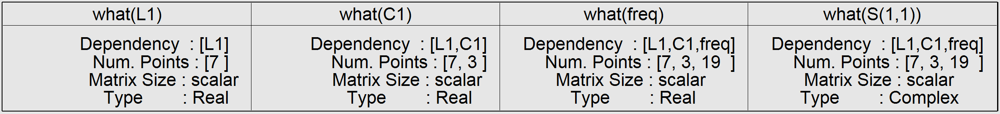
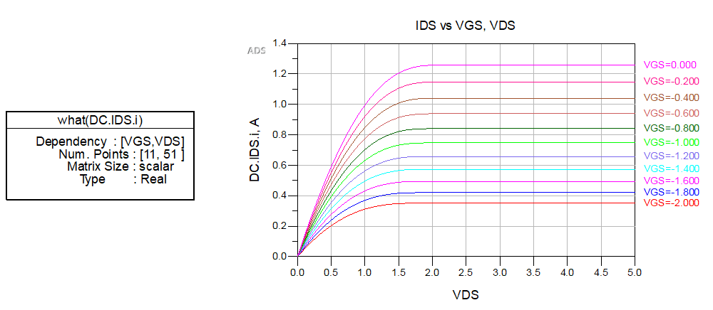
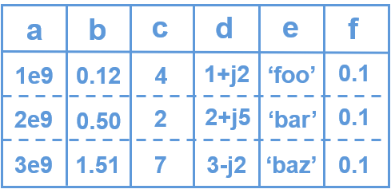
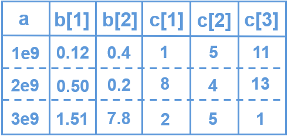
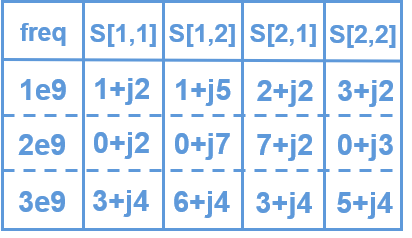

# Multi-Dimensional Data

**Last modified:** 10/04/2021  
**Reading time:** 11 min

The term “multi-dimensional data” here refers to two distinct aspects: [Datasets](#datasets) and [Variables](#variables).

## Datasets

When using `pwdatatools`, it is helpful to have a general understanding of multi-dimensional datasets. First, let’s compare independent variables vs. dependent variables.

**Independent variables:**

- These are the “input” variables that are being directly controlled, swept, set, changed, optimized, or statistically varied.
- Some simulation and measurement examples are frequency, time, DC voltage for swept bias, RF power for swept input power, part parameter values e.g. inductance or capacitance, Monte Carlo Trial number (mcTrial), Batch Simulation number (batchNumber), etc.

**Dependent variables:**

- These are the “output” variables that are measured or calculated.
- Examples are calculated node voltages or branch currents, S-parameters, power measured through a resistor, etc.

If a dataset contains more than one independent variable (ivar), it is *multi-dimensional*. Example: a swept S-parameters simulation vs freq and a capacitor value. The inner ivar is freq, and the outer ivar is capacitance. If a dataset contains one independent variable (ivar) it is not considered multi-dimensional. Example: S-parameters vs freq.

**A multi-dimensional dataset**

- has exactly one inner independent variable
- has one or more outer independent variables
- has one or more dependent variables

The ordering of independent variables (ivars) matters. Ivars depend on any other ivars further outside the nested sweep. The term “level” is used for describing the order. For outer ivar, its level is 0. For the inner ivar, its level is nlevels-1.

Let’s look at an ADS dataset as an example. In Figure 1, the ivars are *L1*, *C1*, and *freq*. The inner ivar *freq* depends on all outer ivars, so *freq* depends on both *L1* and *C1*. *C1* depends on *L1*. The outermost ivar *L1* only depends on itself (no other dependencies), and all dependent variables (e.g. *S11*) depend on all independent variables.

In ADS, the inner ivar is commonly *freq* or *time*, but it’s not always the case, such as for DC simulations. In Figure 2, the *IDS* current depends on both *VGS* (outer ivar) and *VDS* (inner ivar). This dataset resulted from a swept I-V curve simulation of a transistor model.

## Variables

Variables can be scalar, vector, or matrix. Below is a brief explanation of each.

### Scalar

In Figure 3 below, the variables *a*, *b*, *c*, *d*, *e*, and *f* are scalars (although the term scalar might be a bit confusing for string variable *e* since you can’t “scale” anything with a string). A scalar variable contains a single value at each observation (row). A scalar variable has a single value in each row (observation). Note that if a variable has the same value for all observations, as is the case for variable *f*, it can be called a *constant*. Scalar variables may be any one of the following data types: integer, float, complex, or string.

### Vector

In Figure 4 below, *b* and *c* are vector variables. A vector is essentially a one-dimensional matrix variable. `pwdatatools` follows a naming convention that identifies vector variables: the names must contain a single integer index inside of square brackets. Furthermore, the integer index must be one-based (instead of zero-based). This design decision was made in order to maintain compatibility with ADS. The *b* variable is a vector with a dimension of (2,), and the *c* variable has a dimension of (3,). Vector variables can be of type integer, float, complex, or string. However, note that all columns of a vector variable must be of the same data type. For example, all of the *b* variable’s columns contain float data, and all of the *c* variable’s columns contain integer data.

### Matrix

Variables themselves can also be multi-dimensional. A common example is S-parameters, which have two dimensions (output_portnumber, input_portnumber). Matrix variable names must have their dimensions inside of square brackets, with each index separated by a comma (with no spaces). In order to maintain compatibility with ADS, each index must be one-based (not zero-based). In Figure 5, note that each S-parameter in the *S* variable is complex. Matrix variables can be of any supported data type: integer, float, complex, or string. However, all values in all columns associated with a particular matrix variable must be of the same data type. In order to maintain compatibility with ADS, no column should be missing from a matrix variable. Also note that ADS does not directly support matrix variables with more than 2 dimensions. Therefore, a variable with columns like *foo[1,1,1]*, *foo[1,1,2]*, etc. are not supported when writing out ADS datasets.

