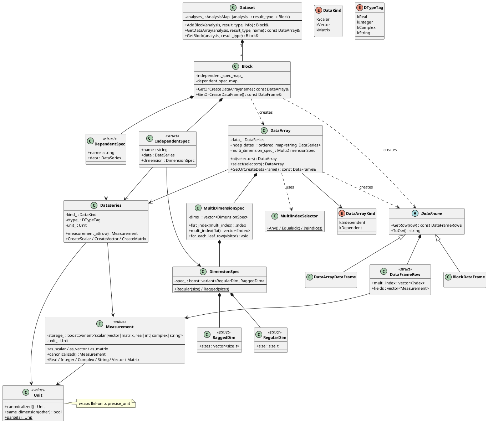

# xdataset 库架构文档

**创建日期：** 2026/07/21

---

## 一、整体类图



---

## 二、层次架构

库采用**五层架构**，从底层物理单位到顶层数据集容器逐层构建：

```
┌──────────────────────────────────────────────────────┐
│  Layer 5  Dataset       顶层容器（Analysis → Block） │
├──────────────────────────────────────────────────────┤
│  Layer 4  Block          数据块（独立变量 + 依赖变量） │
│           DataFrame      惰性分块表格视图              │
├──────────────────────────────────────────────────────┤
│  Layer 3  DataArray      带坐标轴的命名变量             │
│           MultiDimensionSpec  多维坐标空间定义          │
│           MultiIndexSelector  多维索引选择器            │
├──────────────────────────────────────────────────────┤
│  Layer 2  DataSeries     多行同构列容器                 │
├──────────────────────────────────────────────────────┤
│  Layer 1  Measurement    单行带单位值（标量/向量/矩阵）  │
│           Unit           物理单位包装                   │
└──────────────────────────────────────────────────────┘
```

---

## 三、核心类职责

### 3.1 Unit（物理单位）

| 属性 | 说明 |
|------|------|
| **定位** | 物理单位类型，只接受 REL 词汇表中的单位字符串 |
| **底层依赖** | `llnl-units` 库的 `precise_unit` |
| **核心能力** | 单位解析、规范化（canonicalized）、量纲比较、最佳显示比例选择 |

**设计要点：**
- 用户通过 `Unit::parse("GHz")` 构造，内部验证 REL 词汇表
- `Unit::canonicalized()` 将 multiplier 吸收到 base_units 中返回规范形式
- `Unit::best_display(value)` 为给定原始值选择最佳显示比例（如 1e9 Hz → GHz）
- 支持 `operator*` / `operator/` 在规范单位上做量纲运算

---

### 3.2 Measurement（单行测量值）

| 属性 | 说明 |
|------|------|
| **定位** | 栈上值类型，系统的"原子数据" |
| **存储** | `boost::variant` 覆盖 12 种 (DataKind × DTypeTag) 组合 |
| **核心能力** | 类型安全访问（as_scalar/as_vector/as_matrix）、元素访问、规范化 |

**支持的数据形态：**

| DataKind | DTypeTag | 底层类型 |
|----------|----------|----------|
| kScalar | kReal / kInteger / kComplex / kString | `double` / `int` / `complex<double>` / `string` |
| kVector | kReal / kInteger / kComplex / kString | `Eigen::VectorXd` / `VectorXi` / `VectorXcd` / `Tensor<string,1>` |
| kMatrix | kReal / kInteger / kComplex / kString | `Eigen::MatrixXd` / `MatrixXi` / `MatrixXcd` / `Tensor<string,2>` |

**设计要点：**
- 值语义：可拷贝、移动、按值传递
- 始终携带 `Unit`
- 通过 `Measurement::Real(3.14)` 等静态工厂构造
- `element_at(i)` 从向量/矩阵中提取单个元素为新的标量 Measurement

---

### 3.3 DataSeries（数据列）

| 属性 | 说明 |
|------|------|
| **定位** | 多行同构容器，列式存储 |
| **存储** | 内部使用 `detail::Storage` 连续存储 |
| **核心能力** | 创建（CreateScalar/CreateVector/CreateMatrix）、resize、fill、迭代器访问 |

**设计要点：**
- 一个 DataSeries 的所有行具有相同的 kind、dtype、shape、unit
- 提供 `iterator` / `const_iterator`，通过 `RowView` / `ConstRowView` 访问单行
- 支持按行访问 `measurement_at(row)` 返回 Measurement
- 模板工厂方法：`DataSeries::CreateScalar<double>(100)` 创建 100 行 double 标量列

---

### 3.4 DimensionSpec & MultiDimensionSpec（维度定义）

| 类 | 说明 |
|----|------|
| **DimensionSpec** | 单维度定义：Regular（固定大小）或 Ragged（不规则，每父节点不同子节点数） |
| **MultiDimensionSpec** | 多个 DimensionSpec 的集合，定义完整的多维坐标空间 |

**维度类型：**
- **RegularDim**：所有父节点下的子节点数相同，如 `Regular(5)` 表示每个父节点有 5 个子节点
- **RaggedDim**：不同父节点下子节点数不同，如 `Ragged({2, 3, 4})` 表示三个父节点分别有 2、3、4 个子节点

**核心能力：**
- CSR 风格索引转换：`flat_index(multi_index)` ↔ `multi_index(flat)`
- 叶子行遍历：`for_each_leaf_row(visitor)` 按 row-major 顺序访问所有叶子
- 维度级分组遍历：`for_each_group_at_dim(dim_idx, visitor)` 在指定维度层级遍历分组
- 支持范围遍历：`for_each_leaf_row(visitor, start, end)` 按 [start, end) 范围分块访问

---

### 3.5 MultiIndexSelector（多维选择器）

| 属性 | 说明 |
|------|------|
| **定位** | 在多维坐标空间中选择子集的 DSL |
| **选择类型** | `Any`（全选）、`Equal(idx)`（单值等值）、`In({indices})`（多值包含） |

**典型用法：**
```cpp
// 选择第0维=1，第1维任意，第2维∈{0,2} 的数据
auto result = data_array.select({
    MultiIndexSelector::Equal(1),
    MultiIndexSelector::Any(),
    MultiIndexSelector::In({0, 2})
});
```

---

### 3.6 DataArray（带坐标轴的变量）

| 属性 | 说明 |
|------|------|
| **定位** | 命名变量，将数据与坐标轴绑定 |
| **组成** | 自身 DataSeries + 独立变量 DataSeries + MultiDimensionSpec |

**两种类型：**
- **Independent（独立变量）**：如频率点 `freq = [1GHz, 2GHz, 3GHz]`，无上游坐标
- **Dependent（依赖变量）**：如 S 参数 `S21`，其坐标由独立变量定义

**核心能力：**
- 算术运算符：`+`, `-`, `*`, `/`（DataArray-DataArray 和 DataArray-Measurement 广播）
- 索引切片：`at(selectors)` / `select(selectors)` 使用 MultiIndexSelector
- 提取子独立变量：`indep(index)` / `indep(name)`
- 生成表格视图：`GetOrCreateDataFrame()` → `DataArrayDataFrame`
- `pow(base, exp)` 幂运算

**算术广播规则：**
- DataArray × DataArray：要求维度兼容，按 DataArray 维度广播
- DataArray × Measurement：对标量/向量按维度广播到 DataArray 的每个元素

---

### 3.7 DataFrame（表格视图）

| 属性 | 说明 |
|------|------|
| **定位** | 惰性加载的表格容器，提供按行访问和 CSV 导出 |
| **加载策略** | 按固定大小的 chunk 分批加载，避免全量加载 |

**类层次：**
```
DataFrame  (抽象基类，定义接口 + 分块加载逻辑)
├── BlockDataFrame      —— 基于 Block 的所有独立+依赖变量生成表格
└── DataArrayDataFrame  —— 基于单个 DataArray 及其坐标生成表格
```

**设计要点：**
- `Configure(headers, total_rows, generator)` 设置表头、总行数和行生成器
- `GetRow(row)` 自动按需加载所在 chunk
- `ToCsv()` / `WriteToCsv(path)` 导出为 CSV 格式
- 每行是一个 `DataFrameRow`：包含 `multi_index`（多维坐标）和 `fields`（各列 Measurement 值）

---

### 3.8 Block（数据块）

| 属性 | 说明 |
|------|------|
| **定位** | 一次仿真结果的完整数据块 |
| **组成** | 多个独立变量（IndependentSpec）+ 多个依赖变量（DependentSpec） |

**数据结构：**
```
Block
├── IndependentSpec: { name, DataSeries, DimensionSpec }
│   例如: freq → DataSeries(1GHz,2GHz,3GHz), RegularDim(3)
├── DependentSpec: { name, DataSeries }
│   例如: S21 → DataSeries(complex values...)
│   例如: S11 → DataSeries(complex values...)
```

**核心能力：**
- `GetOrCreateDataArray(name)`：惰性构造 DataArray（从 IndependentSpec/DependentSpec + 坐标信息组合）
- `GetOrCreateDataFrame()`：惰性构造 BlockDataFrame
- 保证 DataArray 名称唯一性

**Dimensions 推导逻辑：**
- 独立变量的 DimensionSpec 定义多维坐标空间
- 依赖变量的坐标由所有独立变量的维度笛卡尔积决定
- 例如：`freq(3) × power(4)` → 依赖变量有 12 行，MultiDimensionSpec = [Regular(3), Regular(4)]

---

### 3.9 Dataset（数据集）

| 属性 | 说明 |
|------|------|
| **定位** | 顶层容器，管理所有仿真分析的数据 |
| **层级** | `Dataset → Analysis → ResultType → Block → DataArray` |

**层级示例：**
```
noise (Dataset)
├── SP1 (Analysis)
│   ├── SP (ResultType) → Block "noise.SP1.SP"
│   │   ├── freq (Independent DataArray)
│   │   ├── S21  (Dependent DataArray)
│   │   └── S11  (Dependent DataArray)
│   └── HB (ResultType) → Block "noise.SP1.HB"
│       ├── freq (Independent DataArray)
│       └── Pout (Dependent DataArray)
└── SP2 (Analysis)
    └── SP (ResultType) → Block "noise.SP2.SP"
        ├── freq (Independent DataArray)
        └── S21  (Dependent DataArray)
```

**快捷访问：**
- 完整路径：`dataset.GetDataArray("SP1", "SP", "S21")` → `noise.SP1.SP.S21`
- 唯一名称快捷方式：`dataset.GetDataArray("S21")` → 当 `S21` 在整个 Dataset 中唯一时可用（`noise..S21` 语义）

---

## 四、数据流总结

```
                          ┌──────────────┐
                          │    Unit      │  (物理单位)
                          └──────┬───────┘
                                 │ 组合
                          ┌──────▼───────┐
                          │ Measurement  │  (单行值 = 数据 + 单位)
                          └──────┬───────┘
                                 │ 连续存储多行
                          ┌──────▼───────┐
                          │  DataSeries  │  (同构列)
                          └──────┬───────┘
                                 │ 绑定坐标轴
              ┌──────────────────┼──────────────────┐
              │                  │                  │
    ┌─────────▼─────────┐  ┌────▼────────┐  ┌──────▼──────────┐
    │ DimensionSpec     │  │  DataArray  │  │ MultiDimension  │
    │ (Regular/Ragged)  │  │  (变量)     │  │ Spec (坐标空间)  │
    └───────────────────┘  └────┬────────┘  └─────────────────┘
                                │ 组织为块
                         ┌──────▼───────┐
                         │    Block     │  (数据块)
                         └──────┬───────┘
                                │ 分层组织
                         ┌──────▼───────┐
                         │   Dataset    │  (数据集)
                         └──────────────┘
```

**表格视图（交叉关注点）：**
- `Block → BlockDataFrame`：展开所有独立+依赖变量为宽表
- `DataArray → DataArrayDataFrame`：展开单个变量及其坐标为表
- 两者都继承自 `DataFrame`，共享分块加载和 CSV 导出能力
