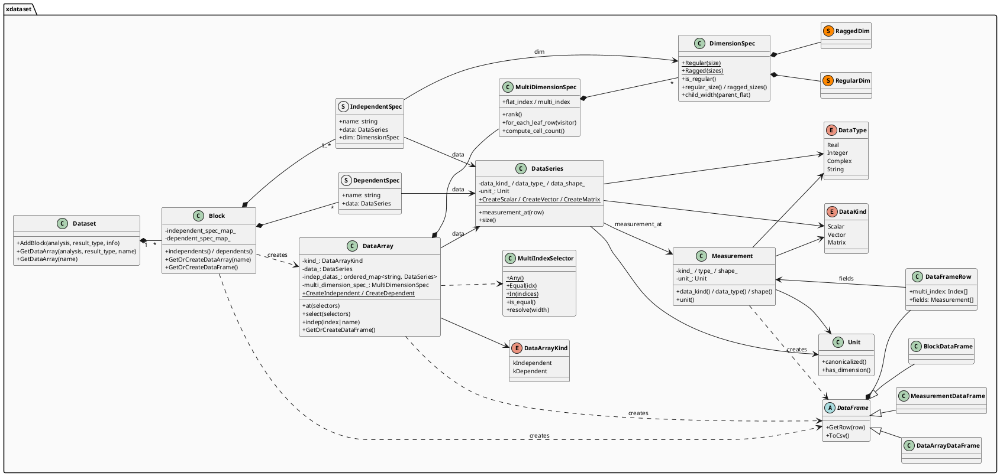
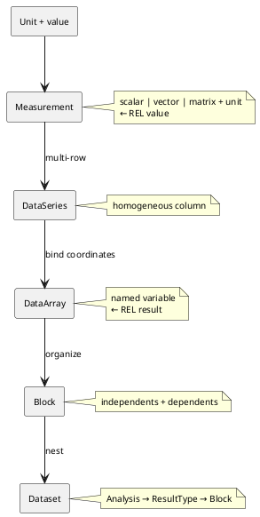

# XDataset

XDataset 是 [REL](../REL/REL.md)（ResultsView Expression Language）语言的基础运行时数据结构库，有两个核心目标：

1. **统一表达复杂多维仿真结果** — 提供从底层物理单位到顶层数据集容器的完整类型体系，统一描述仿真中常见的标量/向量/矩阵、独立/依赖变量、多维坐标网格等结构。
2. **作为 REL 表达式求值的数据载体** — `Measurement` 和 `DataArray` 均可作为 REL 表达式的计算结果，支持带单位算术、多维索引切片和广播运算。

---

## Class Diagram



---

## Data Model

XDataset 的类型体系自底向上逐层构建：



### Measurement

| 属性 | 类型 | 说明 |
|------|------|------|
| DataKind | `Scalar` / `Vector` / `Matrix` | 形状类别 |
| DataType | `Real` / `Integer` / `Complex` / `String` | 元素类别 |
| Shape | `[]` / `[width]` / `[rows, cols]` | 具体尺寸 |
| Unit | `Unit` | 物理单位 |

`DataType` x `DataKind` 共 3 x 4 = 12 种组合，涵盖标量、向量和矩阵形式的所有基本数据类型。

#### DataKind

- `Scalar` — 单个值，Shape 为空。如 `3.14`、`"hello"`
- `Vector` — 一维数组，Shape 为 `[width]`。如 `[1.0, 2.0, 3.0]`
- `Matrix` — 二维矩阵，Shape 为 `[rows, cols]`。如 `[[1,2],[3,4]]`

#### DataType

- `Real` — 双精度浮点数 (`double`)
- `Integer` — 整数 (`int`)
- `Complex` — 复数 (`complex<double>`)
- `String` — 字符串 (`string`)

#### Unit

基于 llnl-units，支持 REL 的数值字面量的缩放因子与物理单位的解析（如 `GHz` = G(10^9) x Hz、`mV` = m(10^-3) x V、`cm` = 0.01 meter）。运算时自动推导结果单位。

### DataSeries
| 属性 | 说明 |
|------|------|
| data_kind | DataKind — 所有行共享 |
| data_type | DataType — 所有行共享 |
| data_shape | Shape — 所有行共享 |
| unit | Unit — 所有行共享 |
| 行数据 | `SeriesStorage` 多态 pimpl 连续存储 |

`DataSeries`概念上是**多行 Measurement** 序列，所有行同构（相同 kind、type、shape、unit）。实际底层使用 `SeriesStorage` 多态 pimpl 实现行级连续存储，以保证构造和赋值的效率。Measurement 按需通过 `measurement_at(row)` 获取。

支持 Scalar、Vector、Matrix 三种形状的列，以及 head、tail、iloc、at 等切片操作。

### DataArray
| 属性 | 类型 | 说明 |
|------|------|------|
| kind | `kIndependent` / `kDependent` | 变量类型 |
| data | `DataSeries` | 变量本身的依赖数据 |
| indep_datas | `ordered_map<string, DataSeries>` | 独立变量数据，按插入顺序排列 |
| multi_dimension_spec | `MultiDimensionSpec` | 坐标空间结构 |

`DataArray` 是 xdataset 的核心抽象，代表一个命名仿真变量。每个 DataArray 通过 `multi_dimension_spec` 绑定到坐标空间（如频率 × 功率的二维网格），通过 `indep_datas` 持有其独立变量的原始数据，通过 `data` 持有自身的测量值。`kind` 区分该变量是坐标轴（`kIndependent`）还是挂载在坐标空间上的观测结果（`kDependent`）。

#### Generate

`DataArray` 有四种生成途径：

1. **`Block::GetOrCreateDataArray(name)`** — 最常用。Block 根据 Spec 将独立的 DataSeries 组合为 DataArray：独立变量生成 `kIndependent` DataArray，依赖变量生成 `kDependent` DataArray，`multi_dimension_spec` 由所有独立变量的 DimensionSpec 共同决定，坐标轴数据自动绑定。
2. **静态工厂** — `DataArray::CreateIndependent(...)` 和 `DataArray::CreateDependent(...)` 手动构造。
3. **Selection** — `select`、`at`、`indep` 从已有 DataArray 派生新的 DataArray（详见 [Selection](#selection)）。
4. **算术运算** — `DataArray op DataArray` 或 `DataArray op Measurement` 的结果为新的 DataArray。

#### Dimension

维度描述仿真数据中独立变量的坐标空间结构。例如一次扫描覆盖 3 个频率点和 2 个功率点，则对应一个二维坐标空间。xdataset 通过两个类来表达：

- **MultiDimensionSpec** — `vector<DimensionSpec>`，描述 N 维坐标空间
- **DimensionSpec** — 单个维度，分为 `RegularDim`（固定大小）或 `RaggedDim`（变长，不同父节点下子节点数不同）

`DimensionSpec` 的两种模式分别适用于不同的仿真场景：

**Regular**

所有父节点下的子节点数相同。`Regular(3)` 表示该维有 3 个值，无论上一层索引如何。适用于均匀扫描（如等步长频率扫描）。

示例: 3 个频点 x 2 个功率点：
```text
MultiDimensionSpec = [Regular(3), Regular(2)]
  dim 0 (freq):  Regular(3)  -> [1.0, 2.0, 3.0] GHz
  dim 1 (power): Regular(2)  -> [10, 20]

dim 0 (freq): Regular(3)
+-- freq(0)  1.0GHz
|   |  dim 1 (power): Regular(2)
|   +-- power(0)  10  ->  row(0)
|   +-- power(1)  20  ->  row(1)
+-- freq(1)  2.0GHz
|   +-- power(0)  10  ->  row(2)
|   +-- power(1)  20  ->  row(3)
+-- freq(2)  3.0GHz
    +-- power(0)  10  ->  row(4)
    +-- power(1)  20  ->  row(5)

6 行
```

**Ragged**

不同父节点下子节点数不同。适用于非均匀扫描（如不同偏置点下扫描了不同数量的频率点）。`Ragged({3, 5})` 表示第一组父节点有 3 个子节点，第二组有 5 个。内部维护 prefix_sum 以实现 O(1) 范围查询。

示例: 两个偏置点，每个偏置点扫描了不同数量的频点，每个频点测两个温度：

```text
MultiDimensionSpec = [Regular(2), Ragged({3, 5}), Regular(2)]

dim 0 (bias): Regular(2) -> [1.0V, 2.0V]
+-- bias(0)  1.0V
|   |  dim 1 (freq): size=3  -> [1.0, 2.0, 3.0] GHz
|   |  dim 2 (temp): Regular(2) -> [25, 85]
|   +-- freq(0)  ->  temp(0), temp(1)  ->  row(0), row(1)
|   +-- freq(1)  ->  temp(0), temp(1)  ->  row(2), row(3)
|   +-- freq(2)  ->  temp(0), temp(1)  ->  row(4), row(5)
+-- bias(1)  2.0V
    |  dim 1 (freq): size=5  -> [1.0, 1.5, 2.0, 2.5, 3.0] GHz
    |  dim 2 (temp): Regular(2) -> [25, 85]
    +-- freq[0..4] -> 5x2 = row(6)..row(15)

3x2 + 5x2 = 16 行
```

#### DataArrayKind

两种 DataArray 的区别在于 `indep_datas` 的内容和 `data` 的形状：

**Independent**

`indep_datas` 包含所有上游独立变量的原始 DataSeries 以及自身的原始 DataSeries。`data` 为自身数据展开到完整坐标空间行数后的副本（单维时等于原始）。`multi_dimension_spec` 的维数等于自身在所有独立变量中的序数（含自身）。

以 `power`（第二个独立变量，上游有 `freq`）为例：

```
indep_datas = {"freq": raw(1GHz, 2GHz, 3GHz), "power": raw(10, 20)}   // 上游原始 + 自身原始
data        = expand_to (3,2)  ->  {10, 20, 10, 20, 10, 20}            // 自身展开到 6 行
spec        = [Regular(3), Regular(2)]
```

**Dependent**

`indep_datas` 仅包含所有上游独立变量的原始 DataSeries，不含自身。`data` 为依赖数据的原始 DataSeries，不展开。`multi_dimension_spec` 由所有独立变量的 DimensionSpec 共同决定。

以 `Vout`（依赖 `freq` 和 `power`）为例：

```
indep_datas = {"freq": raw(1GHz, 2GHz, 3GHz), "power": raw(10, 20)}   // 仅独立变量，不含自身
data        = DataSeries(...)                                            // 原始数据，不展开
spec        = [Regular(3), Regular(2)]
```


### Selection

#### MultiIndexSelector

`MultiIndexSelector` 是 xdataset 中的维度选择器，对应 REL 中的索引语法元素：

| 选择器 | REL 语法 | 含义 |
|--------|---------|------|
| `Any()` | `::` | 全选该维度的所有值 |
| `Equal(idx)` | `idx` | 固定到单个索引 |
| `In({a,b,c})` | `1::1::2` 等范围生成器 | 选取指定的一组索引 |

三种选择器以 `vector<MultiIndexSelector>` 的形式传递给 `select` 或 `at`，按维度顺序对应。

当 `select` 的选择器数量少于维度数时，自动向 `vector` 头部 prepend `Any()`——即用户传入的选择器落在尾部，对应低维。`at` 的补齐方向与此相反：选择器不足时尾部 append `Any()`，用户传入的选择器落在头部，对应高维。

> `select` 操作 `multi_dimension_spec` 的维度，返回坐标空间子集；`at` 操作 `data` 的 Shape，返回数据元素子集。两者互不干扰，可组合使用。

#### select

对 `multi_dimension_spec` 的每个维度施加选择器，返回子集 DataArray。`Equal` 消除该维度，`In` 保留但缩小，`Any` 全选。

以三维 Dependent `Vout`（bias(2) × freq: Ragged({3,5}) × temp(2)）为例，三种选择器同时使用：

**运算前 (spec = [Regular(2), Ragged({3,5}), Regular(2)]):**

| | bias | freq | temp | Vout |
|---|---|---|---|---|
| 0,0,0 | 1.0V | 1.0 GHz | 25 | v0 |
| 0,0,1 | 1.0V | 1.0 GHz | 85 | v1 |
| 0,1,0 | 1.0V | 2.0 GHz | 25 | v2 |
| 0,1,1 | 1.0V | 2.0 GHz | 85 | v3 |
| 0,2,0 | 1.0V | 3.0 GHz | 25 | v4 |
| 0,2,1 | 1.0V | 3.0 GHz | 85 | v5 |
| 1,0,0 | 2.0V | 1.0 GHz | 25 | v6 |
| 1,0,1 | 2.0V | 1.0 GHz | 85 | v7 |
| 1,1,0 | 2.0V | 1.5 GHz | 25 | v8 |
| 1,1,1 | 2.0V | 1.5 GHz | 85 | v9 |
| 1,2,0 | 2.0V | 2.0 GHz | 25 | v10 |
| 1,2,1 | 2.0V | 2.0 GHz | 85 | v11 |
| 1,3,0 | 2.0V | 2.5 GHz | 25 | v12 |
| 1,3,1 | 2.0V | 2.5 GHz | 85 | v13 |
| 1,4,0 | 2.0V | 3.0 GHz | 25 | v14 |
| 1,4,1 | 2.0V | 3.0 GHz | 85 | v15 |

**REL**
`Vout[::, 1::1::2, 1]`/`Vout[1::1::2, 1]`

**C++**
`Vout.select({Any(), In({1, 2}), Equal(1)})`/`Vout.select({In({1, 2}), Equal(1)})`

bias: 全选 → 维度保留；freq: 取索引 1,2 → 各 bias 下保留 2 个频点，维度保留；temp: 固定到 85 → 维度消除。

**运算后 (spec = [Regular(2), Ragged({2,2})]):**

| | bias | freq | Vout |
|---|---|---|---|
| 0,0 | 1.0V | 2.0 GHz | v3 |
| 0,1 | 1.0V | 3.0 GHz | v5 |
| 1,0 | 2.0V | 1.5 GHz | v9 |
| 1,1 | 2.0V | 2.0 GHz | v11 |

#### at

根据 DataArray 数据的 DataKind 和 Shape，选取 Vector 的子行或 Matrix 的子矩阵。`multi_dimension_spec` 不变。

**运算前 (S 为 Matrix (2,2), spec = [Regular(2), Regular(3)]):**

| | R | freq | S(1,1) | S(1,2) | S(2,1) | S(2,2) |
|---|---|---|---|---|---|---|
| 0,0 | 50 Ohm | 1.0 GHz | s00 | s01 | s10 | s11 |
| 0,1 | 50 Ohm | 2.0 GHz | s20 | s21 | s30 | s31 |
| 0,2 | 50 Ohm | 3.0 GHz | s40 | s41 | s50 | s51 |
| 1,0 | 75 Ohm | 1.0 GHz | s60 | s61 | s70 | s71 |
| 1,1 | 75 Ohm | 2.0 GHz | s80 | s81 | s90 | s91 |
| 1,2 | 75 Ohm | 3.0 GHz | sa0 | sa1 | sb0 | sb1 |

**REL**
`S(1, ::)`/`S(1)`

**C++**
`S.at({Equal(0), Any()})`/`S.at({Equal(0)})`

REL `()` 取值时使用 1-based 索引，`S(1, ::)` 取矩阵第一行全部列；C++ `at()` 使用 0-based，故 `Equal(0)` 对应第一行。

**运算后 (data 由 Matrix (2,2) 变为 Vector (2), spec 不变):**

| | R | freq | S(1) | S(2) |
|---|---|---|---|---|
| 0,0 | 50 Ohm | 1.0 GHz | s00 | s01 |
| 0,1 | 50 Ohm | 2.0 GHz | s20 | s21 |
| 0,2 | 50 Ohm | 3.0 GHz | s40 | s41 |
| 1,0 | 75 Ohm | 1.0 GHz | s60 | s61 |
| 1,1 | 75 Ohm | 2.0 GHz | s80 | s81 |
| 1,2 | 75 Ohm | 3.0 GHz | sa0 | sa1 |

#### indep

从 Dependent DataArray 中提取其某个独立变量的坐标轴，返回一个新的 Independent DataArray。位于该变量之后的维度被截断。

`indep` 接受独立变量名或 1-based 索引。索引从内向外计数（1 = 最内层维度），即 `indep(1)` 等价于 `indep("temp")`，`indep(2)` 等价于 `indep("freq")`。

以三维 Dependent（bias x freq x temp）为例：

**运算前：**

| | bias | freq | temp | Vout |
|---|---|---|---|---|
| 0,0,0 | 1.0V | 1.0 GHz | 25 | v0 |
| 0,0,1 | 1.0V | 1.0 GHz | 85 | v1 |
| 0,1,0 | 1.0V | 2.0 GHz | 25 | v2 |
| 0,1,1 | 1.0V | 2.0 GHz | 85 | v3 |
| 0,2,0 | 1.0V | 3.0 GHz | 25 | v4 |
| 0,2,1 | 1.0V | 3.0 GHz | 85 | v5 |
| 1,0,0 | 2.0V | 1.0 GHz | 25 | v6 |
| ... | ... | ... | ... | ... |

**REL**
`indep(Vout, "freq")` 或 `indep(Vout, 2)`

**C++**
`Vout.indep("freq")` 或 `Vout.indep(2)`

**运算后 (spec = [Regular(2), Ragged({3,5})], Independent):**

| | bias | freq |
|---|---|---|
| 0,0 | 1.0V | 1.0 GHz |
| 0,1 | 1.0V | 2.0 GHz |
| 0,2 | 1.0V | 3.0 GHz |
| 1,0 | 2.0V | 1.0 GHz |
| ... | ... | ... |

### Block
| 属性 | 类型 | 说明 |
|------|------|------|
| independent_spec_map | `ordered_map<string, IndependentSpec>` | 独立变量定义 |
| dependent_spec_map | `ordered_map<string, DependentSpec>` | 依赖变量定义 |

- **IndependentSpec** — `{ name, DataSeries, DimensionSpec }`：定义一维坐标轴
- **DependentSpec** — `{ name, DataSeries }`：挂载在坐标空间上的测量值

一个典型的`Block`构成如下：

```
Block
+-- IndependentSpec[]  { name, DataSeries, DimensionSpec }
|   R    -> DataSeries(50 Ohm, 75 Ohm),   RegularDim(2)  -> DataArray "R"    (kIndependent)
|   freq -> DataSeries(1.0, 2.0, 3.0 GHz), RegularDim(3) -> DataArray "freq"  (kIndependent)
|
+-- DependentSpec[]  { name, DataSeries }
    S  -> DataSeries(Matrix (2,2) values...) [6 rows]  -> DataArray "S"  (kDependent, spec=(2,3))
    nf -> DataSeries(Vector (2) values...)   [6 rows]  -> DataArray "nf" (kDependent, spec=(2,3))
```

通过 `Block::GetOrCreateDataArray(name)` 可将 Spec 中的 DataSeries 组合为 `DataArray`（详见 [DataArray Generate](#generate)）。

### Dataset
| 属性 | 类型 | 说明 |
|------|------|------|
| blocks | `ordered_map<Analysis, ordered_map<ResultType, Block>>` | 三层嵌套映射，按 Analysis → ResultType 两级键索引 Block |

`Dataset` 是 xdataset 的顶层容器，将仿真数据按 Analysis（分析类型）和 ResultType（结果模式）两级命名空间组织，最终定位到 `Block`。每个 Block 代表一次完整仿真结果——其独立变量定义坐标轴，依赖变量挂载在该坐标空间上。通过 `GetDataArray` 可按路径获取带坐标的命名变量。

- **Analysis** — 仿真分析名称（如 `SP1`、`SP2`），对应一次仿真分析的顶层命名空间
- **ResultType** — 结果类型（如 `SP`、`HB`），区分同一分析下的不同仿真模式
- **Block** — 该 Analysis、ResultType 下的单次仿真结果，包含独立变量 Spec 与依赖变量 DataSeries

典型结构如下：

```text
noise (Dataset)
+-- SP1 (Analysis)
|   +-- SP  (ResultType) -> Block "noise.SP1.SP"
|   |   +-- freq  (Independent)
|   |   +-- Vout   (Dependent)
|   |   +-- gain   (Dependent)
|   +-- HB  (ResultType) -> Block "noise.SP1.HB"
|       +-- freq  (Independent)
|       +-- Pout  (Dependent)
+-- SP2 (Analysis)
    +-- SP  (ResultType) -> Block "noise.SP2.SP"
        +-- freq  (Independent)
        +-- Vout   (Dependent)
```

#### GetDataArray

从 Dataset 中按 Analysis → ResultType → DataArray 路径获取 `DataArray`，对应 REL 变量引用语法：

| REL 语法 | C++ API | 说明 |
|---|---|---|
| `noise.SP1.SP.Vout` | `GetDataArray("SP1", "SP", "Vout")` | 完整路径 |
| `noise..Vout` | `GetDataArray("Vout")` | Vout 在 Dataset 中唯一时的简写 |
| `SP1.SP.Vout` | `GetDataArray("SP1", "SP", "Vout")` | 默认 Dataset 下省略 Dataset 名 |
| `Vout` | `GetDataArray("Vout")` | 默认 Dataset 下唯一变量 |

## DataFrame

`DataFrame` 是面向展示的只读表格抽象，将 Block / DataArray / Measurement 的数据展开为行列视图。通过 `GetOrCreateDataFrame()` 获取，底层按块懒加载。

### DataFrameRow

| 属性 | 类型 | 说明 |
|------|------|------|
| multi_index | `Index[]` | 该行在 MultiDimensionSpec 中的坐标，如 `[0, 1]` |
| fields | `Measurement[]` | 该行各列的值，每个值为一个 Measurement（携带单位） |

### BlockDataFrame

将 Block 的所有独立变量和依赖变量合并为一张宽表。

- **数据源** — `Block` 的 `independent_spec_map` + `dependent_spec_map`
- **表头** — 独立变量列（按 Spec 顺序） → 依赖变量列（按 Spec 顺序）
- **行数** — 由所有独立变量的 DimensionSpec 共同决定
- **行值** — 独立变量列取 multi_index 在该维度上的坐标值，依赖变量列取 DataSeries 在该行号上的 Measurement
- **列展开** — Vector 列展开为 `(1)` … `(width)` 子列，Matrix 列展开为 `(row,col)` 子列

以 `R 2 点 × freq 3 点`、依赖变量 `S`（Matrix (2,2)）和 `nf`（Vector (2)）为例：

|  | R | freq | S(1,1) | S(1,2) | S(2,1) | S(2,2) | nf(1) | nf(2) |
|---|---|---|---|---|---|---|---|---|
| 0,0 | 50 Ohm | 1.0 GHz | 1.0 | 1.2 | 0.9 | 1.1 | 3.5 | 4.0 |
| 0,1 | 50 Ohm | 2.0 GHz | 0.8 | 0.9 | 0.7 | 1.0 | 3.2 | 3.8 |
| 0,2 | 50 Ohm | 3.0 GHz | 0.6 | 0.7 | 0.5 | 0.8 | 2.9 | 3.5 |
| 1,0 | 75 Ohm | 1.0 GHz | 1.1 | 1.3 | 1.0 | 1.2 | 3.8 | 4.2 |
| 1,1 | 75 Ohm | 2.0 GHz | 0.9 | 1.0 | 0.8 | 1.1 | 3.4 | 3.9 |
| 1,2 | 75 Ohm | 3.0 GHz | 0.7 | 0.8 | 0.6 | 0.9 | 3.0 | 3.6 |

### DataArrayDataFrame

将单个 DataArray 及其独立变量展开为表格。

- **数据源** — DataArray 的 `indep_datas` + `data`
- **表头** — 独立变量列（按 indep_datas 顺序） → DataArray 自身的列
- **行数** — 由 DataArray 的 `multi_dimension_spec` 决定
- **列展开** — 同 BlockDataFrame，Vector/Matrix 列展开为标量子列

以 `Vout`（dependent, Scalar, freq × power = 2 × 2）为例：

|  | freq | power | Vout |
|---|---|---|---|
| 0,0 | 1.0 GHz | 10 | 2.0 V |
| 0,1 | 1.0 GHz | 20 | 3.0 V |
| 1,0 | 2.0 GHz | 10 | 4.0 V |
| 1,1 | 2.0 GHz | 20 | 5.0 V |

### MeasurementDataFrame

将单个 Measurement 展开为单行表格，无懒加载。

- **数据源** — 单个 `Measurement`
- **行数** — 始终 1 行
- **列数** — Scalar → 1 列；Vector → `width` 列；Matrix → `rows × cols` 列
- **懒加载** — 无（单行立即生成）

以 `Measurement(Vector, Real, [3], V)` 为例：

|  | V(1) | V(2) | V(3) |
|---|---|---|---|
| 0 | 1.0 V | 2.0 V | 3.0 V |

### Lazy Loading

BlockDataFrame 和 DataArrayDataFrame 按固定行数分块生成，默认每块 256 行。访问某行时，仅当该行所在块尚未生成时才触发该块的批量计算并缓存。`ToCsv()` 遍历时同样按需触发，海量数据下仅在访问范围内分配内存。

## Arithmetic

Me 与 Da 的运算结果由以下四个步骤依次确定：**Measurement/DataArray 推导** → **DataType推导** → **DataShape推导** → **Unit推导**。

### 运算符类别

| 类别 | 运算符 | 结果 DataType | 结果 Unit | 说明 |
|------|--------|--------------|----------|------|
| `kAddSub` | `+` `-` | 按提升规则 | 双方同量纲取任一方，一方无量纲取另一方 | 双方同量纲或无 dim 冲突 |
| `kMul` | `*` | 按提升规则 | 量纲相乘 | -- |
| `kDiv` | `/` | 按提升规则，int/int → Real | 量纲相除 | -- |
| `kMod` | `%` | 按提升规则 | 继承左操作数 | Real 用 `fmod`，Complex 不支持 |
| `kCompare` | `==` `!=` `<` `>` `<=` `>=` | Integer 0/1 | 无量纲 | 要求双方量纲一致; 复数用模值比较 |
| `kLogical` | `&&` `\|\|` | Integer 0/1 | 无量纲 | 非零为真 |
| `kBitwise` | `&` `\|` `^` | Integer | 无量纲 | 仅 Integer 操作数 |
| `kShift` | `<<` `>>` | Integer | 继承左操作数 | 仅 Integer 操作数 |
| `kPow` | `pow` | 按提升规则 | 继承底数 | 指数必须无量纲 |

> 一元运算符 `-`（取负）保持操作数类型和单位；`!`（逻辑非）和 `~`（按位取反）返回 Integer 无量纲。

四种组合决定了结果类型及 DataArray 各成员变量的取值：

| 表达式 | 结果 | 结果 DataArray 成员 |
|---|---|---|
| `Measurement op Measurement` | `Measurement` | -- |
| `DataArray op DataArray` | `DataArray` | `data` 为逐行运算所得 DataSeries，`indep_datas`、`multi_dimension_spec`、`kind` 均继承 LHS |
| `DataArray op Measurement` | `DataArray` | `data` 为 Measurement 广播到每行后的运算结果，`indep_datas`、`multi_dimension_spec`、`kind` 继承 DataArray 侧 |
| `Measurement op DataArray` | `DataArray` | 同上，`indep_datas`、`multi_dimension_spec`、`kind` 继承 DataArray 侧

### DataType推导

运算符类别决定结果 DataType：

- **kAddSub / kMul / kMod** — 按提升规则: Integer → Real → Complex
- **kDiv** — 同提升规则，但 `Integer / Integer` 强制提升为 `Real`
- **kCompare / kLogical / kBitwise / kShift** — 结果始终为 `Integer`
- **kPow** — 按提升规则

提升规则矩阵：

| × | Integer | Real | Complex | String |
|---|---|---|---|---|
| **Integer** | Integer | Real | Complex | -- |
| **Real** | Real | Real | Complex | -- |
| **Complex** | Complex | Complex | Complex | -- |
| **String** | -- | -- | -- | -- |

### DataShape推导

类型确定后，逐元素应用形状广播规则。三种形状（Scalar / Vector / Matrix）的兼容矩阵如下：

| × | Scalar | Vector | Matrix |
|---|---|---|---|
| **Scalar** | Scalar | Vector | Matrix |
| **Vector** | Vector | Vector (同长) | -- |
| **Matrix** | Matrix | -- | Matrix (同行列) |

当 `DataArray op DataArray` 时，逐行应用上表；当 `DataArray op Measurement` 时，`Measurement` 先广播到所有行，再逐元素应用上表。

### Unit推导

运算前双方先 canonicalize（将 multiplier 吸收到基础 SI 单位），再按类别确定结果单位：

| 类别 | 结果单位 | 约束 |
|---|---|---|
| `kAddSub` | 双方同量纲时取任一方，一方无量纲时取另一方 | 双方同量纲，或一方无量纲 |
| `kMul` | 量纲相乘 | -- |
| `kDiv` | 量纲相除 | -- |
| `kMod` | 继承左操作数 | -- |
| `kCompare / kLogical / kBitwise` | 无量纲 | kCompare 要求双方量纲一致 |
| `kShift` | 继承左操作数 | -- |
| `pow(base, exp)` | 继承 base 的量纲 | exp 必须无量纲 |

### Example

设 `Vout` 为 DataArray（dependent, Scalar），坐标 `freq(2) × power(2)`，`I` 为 Measurement（Vector, (2), A）。计算 `Vout * I`：

**运算前：**

| 参与者 | 类型 | Shape | Spec |
|------|------|------|------|
| Vout | DataArray (dependent) | Scalar | [Regular(2), Regular(2)] |
| I | Measurement | Vector (2) | -- |

**Vout:**

| | freq | power | Vout |
|---|---|---|---|
| 0,0 | 1.0 GHz | 10 | 2.0 V |
| 0,1 | 1.0 GHz | 20 | 3.0 V |
| 1,0 | 2.0 GHz | 10 | 4.0 V |
| 1,1 | 2.0 GHz | 20 | 5.0 V |

**I:**

| I(1) | I(2) |
|------|------|
| 2.0 A | 3.0 A |

**运算后 (result = Vout × I):**

- Measurement/DataArray 推导: `DataArray op Measurement` → 结果为 DataArray
- DataType 推导: Real × Real → Real
- DataShape 推导: Scalar × Vector(2) → Vector(2)
- Unit 推导: V × A = W

| | freq | power | P(1) | P(2) |
|---|---|---|---|---|
| 0,0 | 1.0 GHz | 10 | 4.0 W | 6.0 W |
| 0,1 | 1.0 GHz | 20 | 6.0 W | 9.0 W |
| 1,0 | 2.0 GHz | 10 | 8.0 W | 12.0 W |
| 1,1 | 2.0 GHz | 20 | 10.0 W | 15.0 W |

`result.spec = [Regular(2), Regular(2)]`，`indep` 继承自 Vout。
