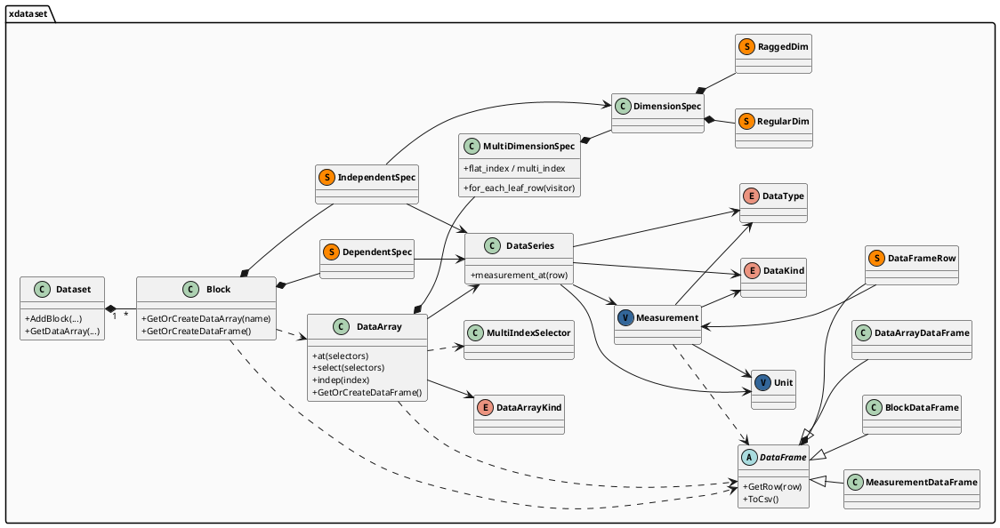

# XDataset 架构文档

XDataset 是 [REL](../REL/REL.md)（ResultsView Expression Language）语言的基础运行时数据结构库，有两个核心目标：

1. **统一表达复杂多维仿真结果** — 提供从底层物理单位到顶层数据集容器的完整类型体系，统一描述仿真中常见的标量/向量/矩阵、独立/依赖变量、多维坐标网格等结构。
2. **作为 REL 表达式求值的数据载体** — `Measurement` 和 `DataArray` 均可作为 REL 表达式的计算结果，支持带单位算术、多维索引切片和广播运算。

---

## 类图概览



---

## 一、核心类型：从原子值到数据集

XDataset 的类型体系自底向上逐层构建：

```
Unit + 值  ->  Measurement     单行原子值 (标量 | 向量 | 矩阵) + 物理单位   <- REL 标量/向量/矩阵
              |  多行连续存储
             DataSeries         同构列容器 (多行 Measurement)
              |  绑定独立变量坐标轴
             DataArray          带坐标的命名变量                          <- REL 仿真变量结果
              |  组织为块
             Block              单次仿真结果合集 (独立变量 + 依赖变量)
              |  分层嵌套
             Dataset            顶层数据集 (Analysis -> ResultType -> Block)
```

### Measurement

栈上值类型，表示一个"数据点"。每个 Measurement 由四个属性定义：

- **DataKind** — 形状类别：`Scalar`（标量）、`Vector`（向量）、`Matrix`（矩阵）
- **DataType** — 元素类别：`Real`（双精度浮点）、`Integer`（整数）、`Complex`（复数）、`String`（字符串）
- **Shape** — 具体尺寸：Scalar 为空，Vector 为 `[width]`，Matrix 为 `[rows, cols]`
- **Unit** — 基于 llnl-units，支持 REL 的数值字面量的缩放因子与物理单位的解析（如 `GHz`、`mV`、`cm`等），支持运算时自动推导结果单位。

`DataType` + `DataKind` 的全部 3 × 4 种组合涵盖标量、向量和矩阵形式的所有基本数据类型。

### DataSeries

表示同一物理量的多次测量序列——简而言之是**多行 Measurement**。所有行共享相同的 `DataKind`、`DataType`、`Shpae` 和 `Unit`。

> DataSeries 仅在概念上由多个 Measurement 组成。实际底层使用 `SeriesStorage` 多态 pimpl 实现行级连续存储，以保证构造和赋值的效率。Measurement 按需通过 `measurement_at(row)` 获取。

支持 Scalar、Vector、Matrix 三种形状的列，以及 head、tail、iloc、at 等切片操作。

### DataArray

**带坐标轴的命名变量**，将 DataSeries（依赖数据）与其独立变量坐标轴绑定。分为两种：

| Kind | 含义 | 示例 |
|------|------|------|
| `kIndependent` | 独立变量，无上游坐标 | `freq = [1GHz, 2GHz, 3GHz]` |
| `kDependent` | 依赖变量，坐标由独立变量定义 | S参数随freq的变化而变化 |

### 维度坐标

坐标轴由 `MultiDimensionSpec` 描述，它是一组 `DimensionSpec` 的有序列表，每个 `DimensionSpec` 定义坐标空间中的一个维度。`DimensionSpec` 支持两种模式：

- **Regular** — 固定大小，所有父节点下的子节点数相同。例如 `Regular(3)` 表示该维有 3 个值，无论上一层索引如何
- **Ragged** — 变长，不同父节点下子节点数不同。例如 `Ragged({3, 5})` 表示第一组父节点有 3 个子节点，第二组有 5 个

依赖变量的总行数由所有独立变量的 DimensionSpec 共同决定（Regular 维度相乘，Ragged 维度各分支求和后再乘）。

**Regular 示例 -- 3 个频点 x 2 个功率点：**

```text
MultiDimensionSpec = [Regular(3), Regular(2)]
  dim 0 (freq):  Regular(3)  -> [1.0, 2.0, 3.0] GHz
  dim 1 (power): Regular(2)  -> [10, 20]

dim 0 (freq): Regular(3)
+-- freq[0]  1.0GHz
|   |  dim 1 (power): Regular(2)
|   +-- power[0]  10  ->  row[0]
|   +-- power[1]  20  ->  row[1]
+-- freq[1]  2.0GHz
|   +-- power[0]  10  ->  row[2]
|   +-- power[1]  20  ->  row[3]
+-- freq[2]  3.0GHz
    +-- power[0]  10  ->  row[4]
    +-- power[1]  20  ->  row[5]

6 行
```

**Ragged 示例 -- 两个偏置点，每个偏置点扫描了不同数量的频点，每个频点测两个温度：**

```text
MultiDimensionSpec = [Regular(2), Ragged({3, 5}), Regular(2)]

dim 0 (bias): Regular(2) -> [1.0V, 2.0V]
+-- bias[0]  1.0V
|   |  dim 1 (freq): size=3  -> [1.0, 2.0, 3.0] GHz
|   |  dim 2 (temp): Regular(2) -> [25C, 85C]
|   +-- freq[0]  ->  temp[0], temp[1]  ->  row[0], row[1]
|   +-- freq[1]  ->  temp[0], temp[1]  ->  row[2], row[3]
|   +-- freq[2]  ->  temp[0], temp[1]  ->  row[4], row[5]
+-- bias[1]  2.0V
    |  dim 1 (freq): size=5  -> [1.0, 1.5, 2.0, 2.5, 3.0] GHz
    |  dim 2 (temp): Regular(2) -> [25C, 85C]
    +-- freq[0..4] -> 5x2 = row[6]..row[15]

3x2 + 5x2 = 16 行
```

### 索引与切片

DataArray 支持两种索引操作，分别作用于不同层级：

**select -- 按 MultiDimensionSpec 维度筛选：** 对坐标空间的各维度施加选择器，返回子集 DataArray。`Equal` 消除该维度，`In` 保留但缩小该维度。

```cpp
// freq(3) x power(2) -> 选 freq 的第 0、2 个点 (In 保留), power 的第 1 个点 (Equal 消除)
auto result = s21.select({
    MultiIndexSelector::In({0, 2}),    // freq 维缩小为 2
    MultiIndexSelector::Equal(1)       // power 维消除
});
// result -> [Regular(2)], 2 行
```

**at -- 按 Measurement 形状索引：** 当 DataArray 的数据为 Vector 或 Matrix 时，选择其中的行或列，MultiDimensionSpec 结构不变。

```cpp
// S(Matrix [2,2]) -> 选第 1 行
auto result = s_matrix.at({
    MultiIndexSelector::Equal(0),     // 行: 取第 0 行
    MultiIndexSelector::Any()         // 列: 全选
});
// result 的 data 变为 Vector [2], multi_dimension_spec 不变
```

**indep -- 提取独立变量：** 从依赖 DataArray 中提取其某个独立坐标轴为独立的 DataArray。

```cpp
DataArray s21 = block.GetOrCreateDataArray("S21");  // dependent
DataArray f   = s21.indep("freq");                   // independent, = [1GHz,2GHz,3GHz]
```

`MultiIndexSelector` 提供三种匹配方式：

| 选择器 | select 效果 | at 效果 |
|--------|------------|---------|
| `Any()` | 维度保留，全选 | 全选 |
| `Equal(idx)` | **维度消除** | 单选行/列 |
| `In({a,b,c})` | 维度保留，子集 | 子集行/列 |

### Block

一次仿真结果的合集，通过 `IndependentSpec` 和 `DependentSpec` 定义：每个独立变量（含 DataSeries + DimensionSpec）定义一维坐标轴，每个依赖变量（含 DataSeries）挂载在坐标空间上。Block 的核心能力是根据这些 Spec，将独立的 DataSeries 组合为 `DataArray`——独立变量生成 `kIndependent` 的 DataArray，依赖变量生成 `kDependent` 的 DataArray，其 MultiDimensionSpec 由所有独立变量的 DimensionSpec 共同决定，坐标轴数据自动绑定。

```
Block
+-- IndependentSpec[]  { name, DataSeries, DimensionSpec }
|   R    -> DataSeries(50 Ohm, 75 Ohm),   RegularDim(2)  -> DataArray "R"    (kIndependent)
|   freq -> DataSeries(1.0, 2.0, 3.0 GHz), RegularDim(3) -> DataArray "freq"  (kIndependent)
|
+-- DependentSpec[]  { name, DataSeries }
    S  -> DataSeries(Matrix [2,2] values...) [6 rows]  -> DataArray "S"  (kDependent, spec=[2,3])
    nf -> DataSeries(Vector [2] values...)   [6 rows]  -> DataArray "nf" (kDependent, spec=[2,3])
```

### Dataset

顶层容器，通过三层嵌套将多个 Block 组织为 `Analysis -> ResultType -> Block` 的层级：

```
noise (Dataset)
+-- SP1 (Analysis)
|   +-- SP  (ResultType) -> Block "noise.SP1.SP"
|   |   +-- freq  (Independent)
|   |   +-- S21   (Dependent)
|   |   +-- S11   (Dependent)
|   +-- HB  (ResultType) -> Block "noise.SP1.HB"
|       +-- freq  (Independent)
|       +-- Pout  (Dependent)
+-- SP2 (Analysis)
    +-- SP  (ResultType) -> Block "noise.SP2.SP"
        +-- freq  (Independent)
        +-- S21   (Dependent)
```

访问方式对应 REL 变量引用语法：

| REL 语法 | C++ API | 说明 |
|---|---|---|
| `noise.SP1.SP.S21` | `GetDataArray("SP1", "SP", "S21")` | 完整路径 |
| `noise..S21` | `GetDataArray("S21")` | S21 在 Dataset 中唯一时的简写 |
| `SP1.SP.S21` | `GetDataArray("SP1", "SP", "S21")` | 默认 Dataset 下省略 Dataset 名 |
| `S21` | `GetDataArray("S21")` | 默认 Dataset 下唯一变量 |

---

## 二、表格视图与懒加载

### 行结构

DataFrame 将多维数据展平为一张表。每行是一个 `DataFrameRow`：

```
DataFrameRow: { multi_index: Index[],  fields: Measurement[] }
```

- `multi_index` — 该行在 MultiDimensionSpec 中的坐标，如 `[0, 1]` 表示第 0 维第 0 个、第 1 维第 1 个值
- `fields` — 该行各列的实际值，每个值为一个 Measurement（携带单位）

表头的数量和含义取决于数据来源，行数由 MultiDimensionSpec 决定。

### 基于 Block 的 DataFrame

**BlockDataFrame** 将 Block 的所有独立变量和依赖变量合并为一张宽表：

- **表头**：依次排列所有独立变量列（如 `R`、`freq`），然后是所有依赖变量列（如 `S`、`nf`）。对 Vector 或 Matrix 类型的列，标量元素展开为多列（如 `S(1,1)`、`nf(1)`）
- **行数**：由所有独立变量的 DimensionSpec 共同决定
- **multi_index**：当前行在坐标空间中的位置，如 `[1, 0]` 表示 R 维 index=1（75 Ohm）、freq 维 index=0（1.0 GHz）
- **独立变量列的值**：取 multi_index 在该维度上的值
- **依赖变量列的值**：取依赖变量 DataSeries 在该行号上的值

以 `R 2 点 x freq 3 点`、依赖变量 `S`（Matrix [2,2]）和 `nf`（Vector [2]）为例：

| multi_index | R | freq | S(1,1) | S(1,2) | S(2,1) | S(2,2) | nf(1) | nf(2) |
|---|---|---|---|---|---|---|---|---|
| 0,0 | 50 Ohm | 1.0 GHz | ... | ... | ... | ... | ... | ... |
| 0,1 | 50 Ohm | 2.0 GHz | ... | ... | ... | ... | ... | ... |
| 0,2 | 50 Ohm | 3.0 GHz | ... | ... | ... | ... | ... | ... |
| 1,0 | 75 Ohm | 1.0 GHz | ... | ... | ... | ... | ... | ... |
| 1,1 | 75 Ohm | 2.0 GHz | ... | ... | ... | ... | ... | ... |
| 1,2 | 75 Ohm | 3.0 GHz | ... | ... | ... | ... | ... | ...

### 基于 DataArray 的 DataFrame

**DataArrayDataFrame** 将单个 DataArray 及其独立变量展开：

- **表头**：DataArray 的独立变量列 + DataArray 自身的列
- **行数**：由 DataArray 的 MultiDimensionSpec 决定

### 基于 Measurement 的 DataFrame

**MeasurementDataFrame** 始终只有 1 行，无懒加载。列数取决于 Measurement 形态：Scalar 为 1 列，Vector 为 width 列，Matrix 为 rows x cols 列。

### 懒加载

BlockDataFrame 和 DataArrayDataFrame 按固定行数分块生成，默认每块 256 行。访问某行时，仅当该行所在块尚未生成时才触发该块的批量计算并缓存。`ToCsv()` 遍历时同样按需触发，海量数据下仅在访问范围内分配内存。

---

## 三、算术运算

REL 表达式返回 `Measurement` 或 `DataArray`，二者之间的 `+`、`-`、`*`、`/`、`pow` 遵循统一的组合规则。

### 运算组合

| 表达式 | 结果 | 说明 |
|---|---|---|
| `Measurement op Measurement` | Measurement | 逐元素计算 |
| `DataArray op DataArray` | DataArray | 坐标对齐后逐行计算，要求 MulitDimensionSpec 兼容 |
| `DataArray op Measurement` | DataArray | Measurement 应用到 DataArray 的每一行 |
| `Measurement op DataArray` | DataArray | 同上 |

`pow` 支持以上全部组合，`Measurement` 可出现在底数或指数任意一侧。

### 类型提升

运算双方按以下规则合并类型：

| x | Integer | Real | Complex | String |
|---|---|---|---|---|
| **Integer** | Integer | Real | Complex | -- |
| **Real** | Real | Real | Complex | -- |
| **Complex** | Complex | Complex | Complex | -- |
| **String** | -- | -- | -- | -- |

> `Integer / Integer` 强制为 `Real`。

### 形状兼容

运算对象有三种形状：Scalar、Vector、Matrix。兼容规则如下：

| x | Scalar | Vector | Matrix |
|---|---|---|---|
| **Scalar** | Scalar | Vector | Matrix |
| **Vector** | Vector | Vector (同长) | -- |
| **Matrix** | Matrix | -- | Matrix (同行列) |

当 `DataArray op DataArray` 时，逐行应用上表；当 `DataArray op Measurement` 时，Measurement 先作用于所有行，再逐元素应用上表。

### 单位推导

运算前双方先 canonicalize（将 multiplier 吸收到基础 SI 单位），再按以下规则确定结果单位：

| 运算 | 结果单位 | 约束 |
|---|---|---|
| `a +/- b` | 双方同量纲时取任一方，一方无量纲时取另一方 | 双方同量纲，或一方无量纲 |
| `a * b` | 量纲相乘 | -- |
| `a / b` | 量纲相除 | -- |
| `pow(a, exp)` | 继承 a 的单位 | exp 必须无量纲 |

### 示例

设 `Vout` 为 DataArray（dependent），坐标 `freq(2) x power(2)`，4 行 Scalar。
计算 `Vout * I`，其中 `I` 为 Vector [2] Measurement。

**Vout（DataArray, dependent, Scalar):**

| | freq | power | Vout |
|---|---|---|---|
| 0,0 | 1.0 GHz | 10 | 2.0 V |
| 0,1 | 1.0 GHz | 20 | 3.0 V |
| 1,0 | 2.0 GHz | 10 | 4.0 V |
| 1,1 | 2.0 GHz | 20 | 5.0 V |

**I（Measurement, Vector [2]):**

| I(1) | I(2) |
|------|------|
| 2.0 A | 3.0 A |

**result = Vout * I（DataArray, dependent, Vector [2]):**

| | freq | power | P(1) | P(2) |
|---|---|---|---|---|
| 0,0 | 1.0 GHz | 10 | 4.0 W | 6.0 W |
| 0,1 | 1.0 GHz | 20 | 6.0 W | 9.0 W |
| 1,0 | 2.0 GHz | 10 | 8.0 W | 12.0 W |
| 1,1 | 2.0 GHz | 20 | 10.0 W | 15.0 W |

result.spec = [Regular(2), Regular(2)]，indep 继承自 Vout，单位 = V x A = W。

---

## 四、第三方库依赖

| 库 | 使用位置 | 用途 |
|---|---|---|
| **llnl-units** | `Unit` | 物理单位解析与量纲运算 |
| **Boost.Variant** | `Measurement`, `DimensionSpec` | 变体类型存储 |
| **Eigen** | `Measurement`, `DataSeries` | 数值矩阵/向量/张量容器 |
| **tsl::ordered_map** | `Dataset`, `Block`, `DataArray` | 有序哈希表 |
