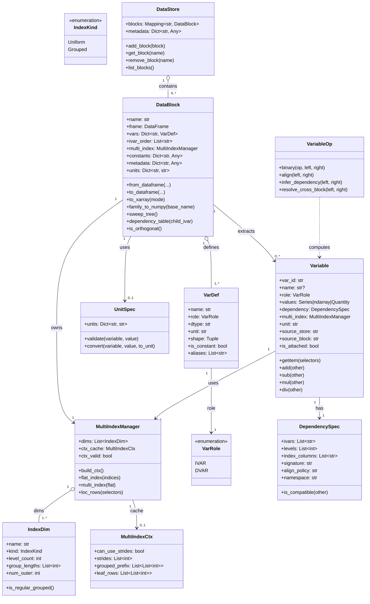

# 多维仿真数据结构设计文档（中文）

## 1. 背景与目标

本文档用于定义一个面向多维仿真数据的数据模型，满足以下目标：

1. 支持顶层数据集与嵌套子数据集组织。
2. 支持独立变量（ivar）与因变量（dvar）的清晰分离。
3. 支持非正交扫参索引关系。
4. 与 pandas、xarray、numpy 互操作友好。
5. 支持基于 pint 的量纲管理与单位换算。

说明：本阶段只给出设计，不包含代码实现。

## 2. 关键术语

1. DataStore：顶层数据容器，可包含多个 DataBlock。
2. DataBlock：独立的数据块，包含数据表、变量定义、常量、元数据、单位信息。
3. Var（变量定义对象）：变量的结构化描述，包含名称、角色、类型、单位等信息。
4. ivar（Independent Variable）：Var 的一种角色，表示扫参或控制维度。
5. dvar（Dependent Variable）：Var 的一种角色，表示仿真或测量结果。
6. 非正交索引：不同上层 ivar 取值下，下层 ivar 可选值集合不同。

## 3. 数据组织原则

采用 tidy data 形式组织观测：

1. 一行表示一个观测点（一个有效索引组合）。
2. 列包括 ivar、dvar、必要辅助列。
3. 不强制笛卡尔积完整网格，只存储真实存在的观测。

这样可自然表达非正交扫参，例如：

1. R=1 时，L 仅有 [1,2]
2. R=2 时，L 仅有 [3,4,5,6]

虽然不构成完整笛卡尔积，但仍构成有效索引关系树。

## 4. 类模型与职责

### 4.1 DataStore（顶层容器）

职责：

1. 管理多个 DataBlock。
2. 保存全局元数据。
3. 提供按名称增删改查 DataBlock 的能力。

核心属性：

1. blocks: Mapping[str, DataBlock]
2. metadata: Dict[str, Any]

### 4.2 DataBlock（数据块）

职责：

1. 持有观测数据表（DataFrame）。
2. 维护变量定义（Var）与索引层级顺序。
3. 维护常量、元数据、单位定义。
4. 提供非正交索引结构查询能力。
5. 提供与 xarray / numpy 的转换入口。

核心属性：

1. name: str
2. frame: pandas.DataFrame
3. vars: Dict[str, VarDef]
4. ivar_order: List[str]
5. constants: Dict[str, Any]
6. metadata: Dict[str, Any]
7. units: Dict[str, str]
8. unit_registry: pint.UnitRegistry
9. multi_index: MultiIndexManager

说明：

1. `ivar`/`dvar`不是独立数据结构，而是 `VarDef.role` 的取值。
2. DataFrame 的列仍然是字符串列名，但语义由 `vars` 中对应 VarDef 约束。

### 4.3 VarDef（变量定义类）

职责：

1. 描述变量语义，而不是仅保存列名。
2. 统一承载角色、数据类型、维度、单位、列族信息。
3. 约束向量/矩阵变量命名和重组规则。

数据归属说明：

1. VarDef 默认不直接存储观测数据。
2. 观测数据统一存放在 DataBlock.frame（DataFrame）中。
3. VarDef 仅保存“如何解释这些列”的元信息（schema/semantic）。
4. 这样可避免数据重复、降低内存占用，并保持与 pandas/xarray 生态一致。

建议属性：

1. name: str
2. role: VarRole（IVAR 或 DVAR）
3. dtype: str
4. unit: str | None
5. shape: Tuple[int, ...] | None
6. is_constant: bool
7. aliases: List[str]

可选扩展（按需）：

1. 对极大数组或懒加载场景，可在 VarDef 中增加 `data_ref`（如外部存储句柄、zarr 路径）。
2. 即使有 `data_ref`，也应视为“引用”，不建议与 DataFrame 同时保存完整副本。

### 4.4 VarRole（枚举）

角色定义：

1. IVAR：独立变量
2. DVAR：因变量

### 4.5 UnitSpec（可选扩展类）

职责：

1. 定义变量名到单位的映射。
2. 执行单位合法性校验与单位换算策略。
3. 与 DataBlock 解耦，便于未来替换单位系统。

说明：若追求简化，也可将其并入 DataBlock 的 units 字段。

### 4.6 Variable（脱离Block的变量视图/结果变量）

职责：

1. 表达从 DataBlock 提取出的单个业务变量（可包含标量/向量/矩阵语义）。
2. 持有变量依赖信息（Dependency），用于对齐、校验和运算兼容性判断。
3. 支持变量间运算，运算结果默认不写回 DataBlock。

建议属性：

1. var_id: str（必填，系统内唯一标识）
2. name: str | None（可选的人类可读名称）
3. role: VarRole
4. values: pandas.Series | numpy.ndarray | pint.Quantity
5. dependency: DependencySpec
6. unit: str | None
7. source_block: str | None
8. is_attached: bool（是否属于某个 DataBlock）
9. source_store: str | None（可选，跨 DataStore 场景）

建议方法：

1. `__getitem__(selectors)`：多维索引访问，语义对齐 DataFrame.loc。

说明：

1. Variable 有两种状态：Attached 与 Detached。
2. 从 DataBlock 提取出来的 Variable，默认应为 Attached（`is_attached=True`），表示其数据仍与源 Block 关联。
3. 计算得到的新变量默认是 Detached（`is_attached=False`），即“临时结果变量”。
4. Attached Variable 可通过显式 detach 操作转为 Detached。
5. Variable 不强制要求 `name`，但必须有唯一 `var_id`。

### 4.7 DependencySpec（依赖描述）

职责：

1. 显式描述一个变量依赖哪些 ivar，以及依赖顺序。
2. 提供依赖签名（Dependency Signature）用于快速判定变量是否可直接逐元素运算。
3. 提供对齐策略元信息（严格匹配/广播/重采样）。

建议属性：

1. ivars: List[str]
2. levels: List[int]
3. index_columns: List[str]
4. signature: str（例如由 ivars+顺序+索引类型规范化后哈希得到）
5. align_policy: str（strict 或 broadcast）
6. namespace: str | None（可选，变量命名域/映射版本）

说明：

1. `signature` 应是“Block 无关”的语义签名，不应包含 block 名称。
2. `source_block` 仅用于追溯来源，不参与可运算性判定。

### 4.8 VariableOp（变量运算规则）

职责：

1. 校验两个 Variable 是否可运算。
2. 执行对齐与单位换算后再进行数值运算。
3. 生成新的 detached Variable，并继承/推导 dependency。

### 4.9 MultiIndexManager（多维索引管理器）

职责：

1. 管理 Uniform/Grouped（含 Ragged）维度元数据。
2. 提供 `flat_index` 与 `multi_index` 的双向映射。
3. 提供 loc 风格的选择器裁剪能力，并返回筛选后的行索引。

参考边界：

1. 仅采用 `multi_index`、`flat_index` 与 `loc` 的语义约束。
2. Variable 的生命周期、Attached/Detached、运算与单位体系保持本文档当前设计。

建议属性：

1. dims: List[IndexDim]
2. ctx_cache: MultiIndexCtx
3. ctx_valid: bool

建议方法：

1. `build_ctx()`：构建加速上下文（规则维度走 stride，ragged 走前缀和/叶子计数）。
2. `flat_index(indices)`：元数据驱动正向映射。
3. `multi_index(flat)`：元数据驱动逆向映射。
4. `loc_rows(selectors)`：返回匹配行号列表。
5. `validate_layout(nrows)`：校验维度元数据与行数一致。

## 5. 类图（Mermaid）

## 6. 非正交索引表达设计

### 6.1 存储策略

1. 仅存储实际观测行，不补齐不存在的组合。
2. `ivar_order` 的顺序表示层级关系（外层到内层）。
3. 任意一行都对应一条从外层 ivar 到内层 ivar 的有效路径。

### 6.2 查询策略

建议提供两类查询：

1. sweep_tree：返回层级化映射，表达“父 ivar 取值 -> 子 ivar 可选值集合”。
2. dependency_table(child_ivar)：给出 child_ivar 在各父条件下的可用值列表。

## 6.3 变量语义与列映射

1. DataFrame 列名是物理存储键。
2. VarDef 是语义定义层，声明该列是 ivar 还是 dvar。
3. 向量/矩阵变量可通过同一 VarDef 的列族映射到多个列。
4. 业务逻辑必须优先依赖 VarDef，而不是仅凭列名猜测角色。

### 6.3.1 Dependency 存储位置

1. 定义级（schema-level）依赖：存放在 DataBlock.vars[name] 对应的 VarDef 中。
2. 实例级（runtime-level）依赖：存放在 Variable.dependency（DependencySpec）中。
3. Attached Variable 的 dependency 由 DataBlock 在 extract_variable 时生成并挂到 Variable。
4. Detached Variable 的 dependency 由运算引擎（VariableOp.infer_dependency）推导并写入结果 Variable。
5. DataFrame 本身不直接存 dependency 对象，DataFrame 只保存观测值与索引列。

### 6.4 Variable 提取与依赖保留

1. DataBlock 提取 Variable 时，必须同时生成 DependencySpec。
2. 对于 dvar，默认依赖于其声明的全部上游 ivar（通常是 ivar_order 全集，或 VarDef 显式子集）。
3. 对于 ivar，本身也可被提取为 Variable，其 dependency 至少包含其外层父 ivar。
4. 对于非正交索引，dependency 中的 index_columns 必须能唯一定位观测行。

示例：

1. 给定 ivar_order=[R, L, freq]。
2. 变量 gain 的 dependency 可表示为 [R, L, freq]。
3. 变量 L 的 dependency 可表示为 [R, L]（或最小父依赖 [R] + 本列）。

### 6.5 变量可运算性判定

两个 Variable 可以直接逐元素运算的必要条件：

1. dependency.signature 相同。
2. 索引键集合一致（index_columns 相同且值域可一一对齐）。
3. 单位可兼容（由 pint 判断，可转换到共同单位）。

若 signature 不同，可选策略：

1. strict：直接报错，不允许隐式对齐。
2. broadcast：仅当一个 dependency 是另一个的父依赖前缀时允许广播。
3. reindex：显式指定对齐目标后再运算。

## 6.6 结果变量不入Block的语义

1. 变量运算结果返回 detached Variable（is_attached=False）。
2. detached Variable 保留 dependency 与 unit 推导信息。
3. 只有调用显式接口（如 attach_to_block）才会把结果写回 DataBlock。
4. 默认不写回可避免污染原始数据和版本歧义。

## 6.7 Variable 生命周期（Attached vs Detached）

1. extract_variable：从 DataBlock 提取时，返回 Attached Variable（默认只读视图）。
2. binary operation：变量运算返回 Detached Variable。
3. detach：将 Attached Variable 显式转为 Detached，后续与原 Block 解耦。
4. attach_to_block：将 Detached Variable 显式注册并写入某个 DataBlock。
5. 为避免副作用，禁止 Detached Variable 隐式回写任何 Block。

## 6.8 跨 Block 变量运算

目标场景：

1. 可从多个 DataBlock 分别提取 Variable。
2. 任意两个 Variable（即使来自不同 block）只要 dependency 兼容即可运算。

设计规则：

1. 可运算性基于 `dependency.signature` 与索引值对齐，不基于 `source_block`。
2. `source_block`/`source_store` 仅用于追溯（provenance）与审计。
3. 当两个 block 的 ivar 名称不同但语义等价时，需通过 `namespace` 或显式映射表统一后再计算。
4. 跨 block 运算结果仍为 detached Variable，不自动写回任一 block。

推荐流程：

1. `v1 = block_a.extract_variable("x")`
2. `v2 = block_b.extract_variable("y")`
3. `v2 = v2.remap_dependency({"frequency": "freq"})`（如有必要）
4. `v3 = VariableOp.binary("add", v1, v2)`

失败条件（需显式报错）：

1. dependency signature 不兼容且未提供允许的对齐策略。
2. 索引键可匹配但存在一对多或多对多歧义。
3. 单位不可转换（例如 V 与 A 在加法中不可兼容）。

## 6.9 Variable 的 [] 多维索引访问

目标：

1. 让 Variable 支持类似 `loc` 的多维切片，而不是仅按一维位置切片。
2. 语义与 dependency/multi_index 一致，避免只看 DataFrame 行号。
3. “去列”在本文档中仅指从 dependency 中移除固定维度，不涉及 DataFrame 物理列删除。

选择器规则（右对齐）：

1. selectors 作用在“最内层的 N 个维度”。
2. 每个维度选择器支持：
    - 单个整数：固定该维度一个位置，结果中该维度被消去。
    - 整数列表：保留这些位置，维度保留。
    - 空列表或全切片：通配，维度保留。
3. 当 grouped/ragged 维度某个外组无匹配位置时，该外组被丢弃。

返回规则：

1. 返回新的 Variable（默认 Detached，避免对源数据产生副作用）。
2. 结果 dependency 会移除被固定的维度（即“去列”语义），并重建 signature。
3. multi_index 元数据同步裁剪并重建，确保 `flat_index <-> multi_index` 仍互逆。

接口建议：

1. 仅暴露 `v[selectors]` 作为 Variable 的多维访问入口。
2. `v[selectors]` 内部委托 `MultiIndexManager.loc_rows(selectors)` 获取行号。
3. 再对 values 做 gather，构造结果 Variable。

## 6.10 multi_index 索引管理

语义借鉴范围：

1. 采用 `flat_index(indices)` 与 `multi_index(flat)` 的互逆语义。
2. 采用 `loc` 的“按索引选择行 + 固定维度去 dependency”语义。
3. 不要求绑定特定外部实现的数据结构、函数签名或内部细节。

核心思想：

1. 优先元数据驱动，不扫描变量值判断分组。
2. 规则维度（Uniform 或 Regular Grouped）使用 stride 快速映射。
3. Ragged 维度使用 grouped_prefix + leaf_rows 进行映射。

建议算法：

1. `build_ctx()`：
    - 若所有维度可 stride，构建 strides。
    - 否则构建 grouped_prefix 与 leaf_rows。
2. `multi_index(flat)`：按 ctx 从 flat 定位每个维度 ordinal。
3. `flat_index(indices)`：按 ctx 从 ordinal 还原 flat。
4. `loc_rows(selectors)`：遍历行的 multi_index，并按选择器过滤。

取行与 dependency 裁剪规则（loc）：

1. 取行：根据 selectors 仅保留匹配行。
2. dependency 裁剪：被单值固定的维度从结果 dependency 中移除。
3. 保列：列表选择或通配选择的维度仍保留在结果 dependency 中。

一致性约束：

1. 对同一 Variable，`flat_index(multi_index(r)) == r`。
2. 选择后结果 Variable 仍满足上述互逆关系。
3. 任何维度元数据变化都必须使 `ctx_valid=False`，下次访问重建 ctx。

## 7. 与生态库的交互设计

### 7.1 pandas

1. DataBlock 内部以 DataFrame 作为唯一主存储。
2. to_dataframe() 输出可直接用于分析、绘图、分组聚合。

### 7.2 xarray

1. orthogonal 模式：仅当索引完整正交时，映射为规则维度 Dataset。
2. ragged 模式：非正交时使用 obs 维度 + ivar 坐标表达。
3. auto 模式：自动判断是否正交并选择输出模式。

### 7.3 numpy

1. 标量变量可直接输出 1D 数组。
2. 向量/矩阵变量采用列族规则（如 S[1,1], S[1,2]）聚合为高维数组。

## 8. 单位与量纲设计（pint）

1. units 维护“变量名 -> 单位字符串”映射。
2. 读写变量时可附带 pint.Quantity。
3. 对外读取时支持按目标单位转换。
4. 常量与变量共享统一单位机制，但允许分别校验策略。

## 9. 约束与校验规则

1. 所有业务变量必须在 `vars` 中定义，并映射到一个或多个 DataFrame 列。
2. 每个列名必须存在且仅存在一个 VarDef 定义。
3. VarDef.role=IVAR 的变量名集合应与 ivar_order 一致。
4. 同一变量在同一 DataBlock 中单位定义应唯一。
5. 向量/矩阵列命名应满足统一模式：name[i] 或 name[i,j]。
6. 索引合法性以“存在观测行为准”，不要求补齐笛卡尔积。
7. Variable 运算前必须进行 dependency 兼容性校验。
8. detached Variable 禁止隐式写回 DataBlock。
9. 每个 Variable 必须有唯一 `var_id`；`name` 可为空。

## 10. 存储与性能设计重点（Variable 场景）

1. Variable 的 values 优先采用“零拷贝视图”策略（如 pandas Series view / numpy view），减少提取成本。
2. 运算结果 Variable 默认采用惰性或半惰性策略：
    - eager：立即计算并持有 values
    - lazy：仅保存表达式树，按需 materialize
3. 建议在 Variable 中增加 provenance 字段记录来源表达式，便于追溯。
4. 对大规模数据可用 data_ref 指向外部存储（例如 parquet/zarr），避免内存爆炸。
5. dependency.signature 应可缓存，避免频繁重复计算。
6. 跨 block 运算时优先使用索引键 join 视图，避免先全量复制再对齐。
7. provenance 建议记录 `source_store/source_block/var_name/op`，支持结果追踪。
8. `MultiIndexCtx` 必须缓存并失效管理，避免每次 []/loc 都重建。
9. ragged 场景优先复用 grouped_prefix 与 leaf_rows，避免 O(N*D) 重扫。

## 11. 后续实现建议

1. 先实现最小核心：DataStore + DataBlock + units 字段。
2. 再实现非正交查询：sweep_tree 与 dependency_table。
3. 最后补充互转能力：to_xarray 与 family_to_numpy。
4. 配套测试优先覆盖：
   - 非正交索引样例（R-L 依赖）
   - 单位换算正确性
   - orthogonal/ragged 自动分流逻辑
    - Variable 提取后 dependency 正确性
    - 同依赖变量运算与 detached 结果语义
    - 跨 block 同依赖变量运算
    - 跨 block 依赖名映射后运算
    - Variable 的 []/loc 右对齐选择器语义
    - flat_index 与 multi_index 的互逆性（Uniform/Regular/Ragged）
